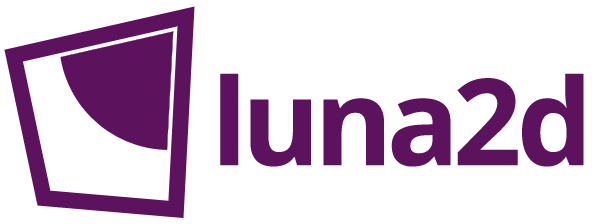

Cross-platform game engine for mobile platforms. Engine is aimed to write all game logic in Lua. But general features written in native code. Uses OpenGL ES 2.0\OpenGL 2.1 on mobile\desktop platofrms.

## Supported platforms
* Desktop Qt platforms
* Android 4.0+
* iOS 6.0+
* Windows Phone\RT 8.1

## Build requirements
* Destkop Windows: Qt 5.4+, compiler with support C++11 (e.g. MinGW 4.8)
* Android: Eclipse, Android SDK, NDK r9+
* iOS: XCode, iOS SDK 8.1+
* Windows Phone\RT: VS2013 Update 4+

## Tools
All tools written in C++\Qt and supports same desktop platforms as engine.

#### Emulator
Emulator for useful testing games on desktop. Can run games in different screen resolutions. 

#### Pipeline
Tool for automatic preparing graphical assets. Includes image resizer and texture packer. 
Supports PSD using **[libqpsd](https://github.com/Code-ReaQtor/libqpsd)**.
